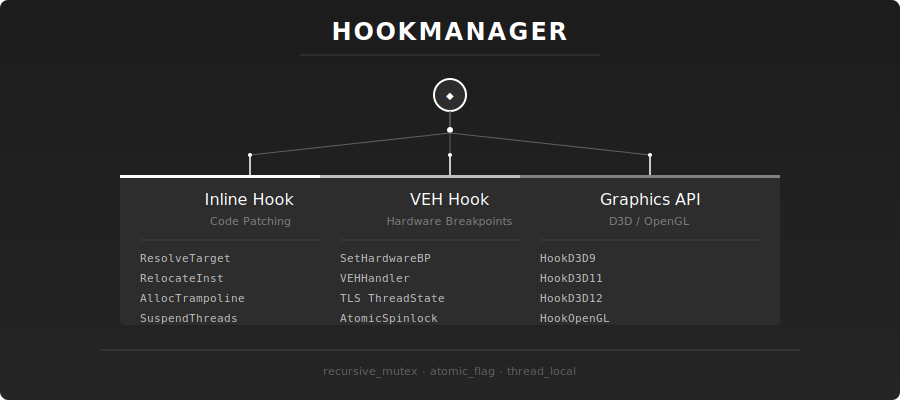
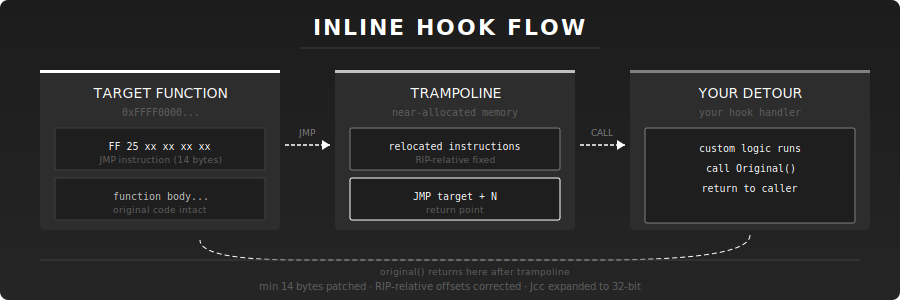

<div align="center">

# AMNESIA HOOK

**x64 stealth hooking library + DirectX 11 overlay base**

C++20 · Windows x64 · Beta

</div>

---

## features

**Inline Hooking**
Custom trampoline allocator keeps all jumps within 2GB bounds. Handles RIP-relative instructions (LEA, CALL, Jcc) and expands 8-bit Jcc to 32-bit when needed.

**VEH Hooking**
Hardware breakpoints via DR0-DR3. Atomic spinlocks + TLS prevent deadlocks. Single instruction resolution without thread blocking.

**DirectX 11**
Dummy swapchain trick resolves `IDXGISwapChain::Present` at VMT index 8. Clean ImGui context setup without game crashes.

**Thread Safety**
All other threads suspended during inline patch writes. No mid-instruction corruption.

---

## api reference

### HookManager

```cpp
static HookManager& GetInstance()
```

Singleton access. Thread-safe init on first call.

---

### Init

```cpp
bool Init()
```

Registers VEH for hardware breakpoint hooks. Auto-called on DLL_PROCESS_ATTACH.

---

### CreateInlineHook

```cpp
bool CreateInlineHook(void* target, void* detour, void** original)
```

Patches target prologue with JMP. Builds trampoline preserving original instruction execution.

| param | description |
|-------|-------------|
| `target` | function to hook |
| `detour` | replacement function |
| `original` | receives trampoline address |

---

### CreateVEHHook

```cpp
bool CreateVEHHook(void* target, void* detour, void** original)
```

Sets hardware breakpoint via VEH. Single instruction hook using DR0-DR3.

| param | description |
|-------|-------------|
| `target` | function to hook |
| `detour` | replacement function |
| `original` | receives trampoline address |

---

### CreateOverlayHook

```cpp
bool CreateOverlayHook(void* target, void* detour, void** original, HookType type)
```

Generic wrapper. `type` = `HookType::Inline` or `HookType::VEH`.

---

### Enable / Disable

```cpp
bool Enable(void* target)
bool Disable(void* target)
```

Activates or deactivates a hook. Inline: patches bytes. VEH: sets/clears debug register.

---

### RemoveHook

```cpp
bool RemoveHook(void* target)
```

Removes hook and frees trampoline memory.

---

### EnableAll / DisableAll

```cpp
bool EnableAll()
bool DisableAll()
```

Bulk activate/deactivate all registered hooks.

---

### IsHooked

```cpp
bool IsHooked(void* target)
```

Returns `true` if address has active hook.

---

## graphics api

### HookD3D11

```cpp
bool HookD3D11(void* detour, void** original)
```

Hooks `IDXGISwapChain::Present` (VMT index 8). Recommended for D3D11 overlay rendering.

### HookD3D9

```cpp
bool HookD3D9(void* detour, void** original)
```

Hooks `IDirect3DDevice9::Present` (VMT index 17).

### HookD3D12

```cpp
bool HookD3D12(void* detour, void** original)
```

Hooks `IDXGISwapChain::Present` for D3D12.

### HookOpenGL

```cpp
bool HookOpenGL(void* detour, void** original)
```

Hooks `wglSwapBuffers`.

---

## usage

```cpp
#include "Amhk.h"

void* g_originalPresent = nullptr;

HRESULThk DetourPresent(IDXGISwapChain* pSwapChain, UINT SyncInterval, UINT Flags) {
    static bool initialized = false;
    static ID3D11Device* pDevice = nullptr;
    static ID3D11DeviceContext* pContext = nullptr;
    static ID3D11RenderTargetView* pRTView = nullptr;

    if (!initialized) {
        pSwapChain->GetDevice(__uuidof(ID3D11Device), (void**)&pDevice);
        pDevice->GetImmediateContext(&pContext);

        ID3D11Texture2D* pBackBuffer = nullptr;
        pSwapChain->GetBuffer(0, __uuidof(ID3D11Texture2D), (void**)&pBackBuffer);
        pDevice->CreateRenderTargetView(pBackBuffer, nullptr, &pRTView);
        pBackBuffer->Release();

        ImGui_ImplWin32_Init(/* hwnd */);
        ImGui_ImplDX11_Init(pDevice, pContext);
        initialized = true;
    }

    ImGui_ImplDX11_NewFrame();
    ImGui_ImplWin32_NewFrame();
    ImGui::NewFrame();

    ImGui::Begin("Amnesia Hook");
    ImGui::Text("Hello, world!");
    ImGui::End();

    ImGui::Render();
    pContext->OMSetRenderTargets(1, &pRTView, nullptr);
    ImGui_ImplDX11_RenderDrawData(ImGui::GetDrawData());

    using Present_t = HRESULT(IDXGISwapChain*, UINT, UINT);
    return ((Present_t*)g_originalPresent)(pSwapChain, SyncInterval, Flags);
}

int main() {
    Amhook::HookManager::GetInstance().HookD3D11((void*)DetourPresent, &g_originalPresent);

    // game loop...
    return 0;
}
```

### build

```sh
cmake -B build
cmake --build build
```

Link against `Amhook.dll` and include `Amhk.h`.

---

## hook comparison

| | Inline | VEH |
|---|--------|-----|
| **Mechanism** | Code patching | Hardware breakpoints |
| **Registers** | None | DR0-DR3 |
| **Hook size** | 14+ bytes | 1 instruction |
| **Stealth** | Lower | Higher |
| **Speed** | Faster | Slower |

---

## diagrams





---

## license

MIT
